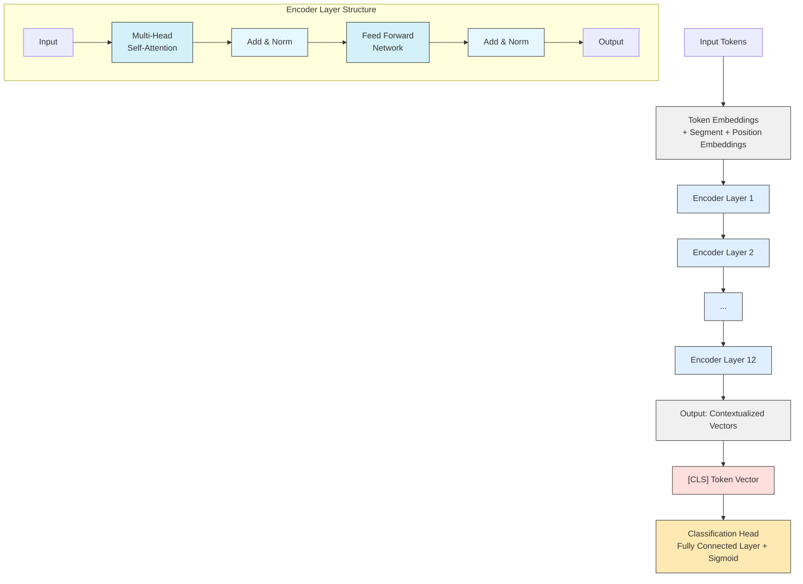

```mermaid
graph TD
    A[Input Tokens] --> B[Token Embeddings<br>+ Segment + Position Embeddings]
    B --> C[Encoder Layer 1]
    C --> D[Encoder Layer 2]
    D --> E[...]
    E --> F[Encoder Layer 12]
    F --> G[Output: Contextualized Vectors]
    G --> H["[CLS] Token Vector"]
    H --> I["Classification Head<br>Fully Connected Layer + Sigmoid"]
    
    subgraph "Encoder Layer Structure"
        Z1[Input] --> Z2[Multi-Head<br>Self-Attention]
        Z2 --> Z3[Add & Norm]
        Z3 --> Z4[Feed Forward<br>Network]
        Z4 --> Z5[Add & Norm]
        Z5 --> Z6[Output]
    end

    style B fill:#f0f0f0,stroke:#333,stroke-width:1px
    style C fill:#dfefff,stroke:#333,stroke-width:1px
    style D fill:#dfefff,stroke:#333,stroke-width:1px
    style E fill:#dfefff,stroke:#333,stroke-width:1px
    style F fill:#dfefff,stroke:#333,stroke-width:1px
    style G fill:#f0f0f0,stroke:#333,stroke-width:1px
    style H fill:#ffdede,stroke:#333,stroke-width:1px
    style I fill:#ffe9b3,stroke:#333,stroke-width:1px
    
    style Z2 fill:#d4f1f9,stroke:#333,stroke-width:1px
    style Z3 fill:#e6f7ff,stroke:#333,stroke-width:1px
    style Z4 fill:#d4f1f9,stroke:#333,stroke-width:1px
    style Z5 fill:#e6f7ff,stroke:#333,stroke-width:1px
```