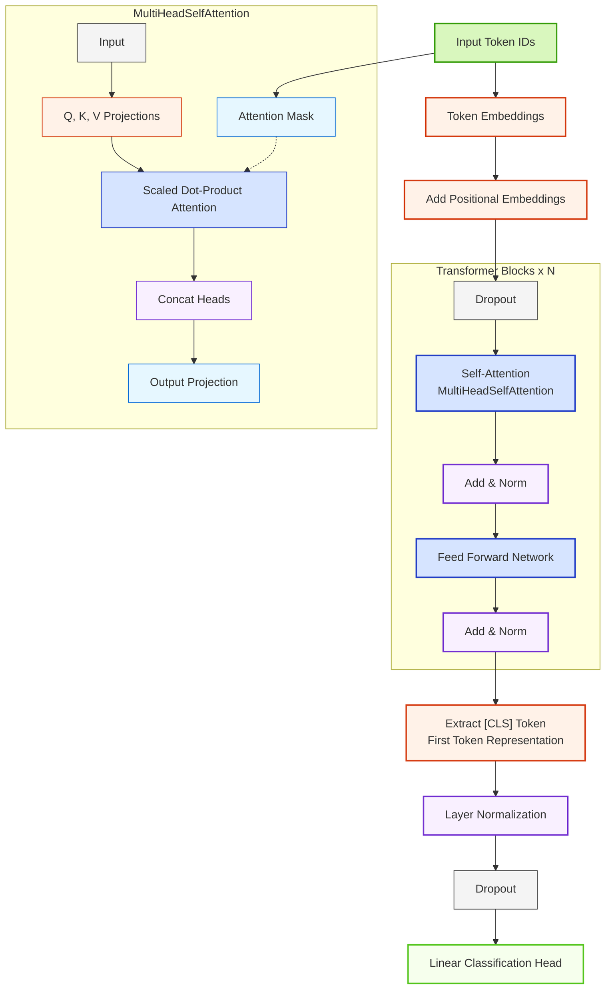

# Lightweight Transformer Architecture

The following diagram illustrates the architecture of the LightweightTransformer model for text classification.

## Model Description

The LightweightTransformer is a simplified version of transformer architecture designed for text classification:

1. **Input Processing**:
   - Token IDs are converted to embeddings
   - Positional information is added via learned positional embeddings

2. **Transformer Encoder** (repeated N times):
   - **Self-Attention Block**: Multi-head self-attention mechanism
   - **Feed-Forward Network**: Two linear transformations with GELU activation

3. **Classification**:
   - Extract the first token ([CLS]) representation
   - Process through normalization, dropout, and linear classification layer

## Model Parameters
- Vocabulary Size: 30,522 (Default for BERT tokenizer)
- Embedding Dimension: 256
- Number of Heads: 4
- Feed-Forward Dimension: 512
- Number of Layers: 3
- Default Maximum Sequence Length: 128
- Default Dropout Rate: 0.1

This architecture provides a more efficient alternative to full-scale transformer models like BERT, with significantly fewer parameters while maintaining strong performance for text classification tasks.
